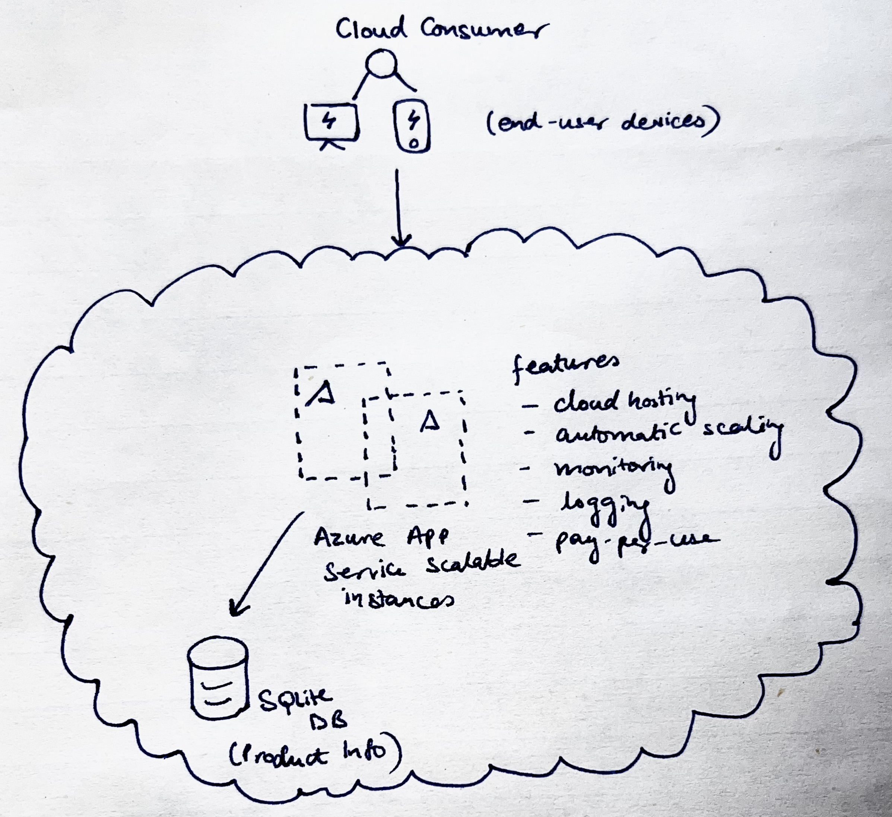

# Product Catalogue Application – Cloud Computing Assignment 2

## Overview

This project implements a Product Catalogue Web Application deployed on a Public Cloud platform (Microsoft Azure).
The application allows users to add new products and view a list of all products through a simple web interface.

The application is hosted on Azure App Service, which provides a publicly accessible URL and scalable cloud infrastructure.

Public URL of the application:

https://productcatalogcloudcomputingassn2.azurewebsites.net

## Features Added and Their Usefulness

### Azure App Service (Cloud Hosting)

The application is deployed using Microsoft Azure App Service, which provides a managed cloud platform for hosting web applications.

Why it is useful:
- Provides a **publicly accessible URL**
- Handles **deployment and hosting automatically**
- Allows applications to **scale easily**

This enables the product catalogue application to be accessed from anywhere through the internet.

### Azure Monitoring and Logging

Azure App Service provides built-in application monitoring and logging capabilities.

Why it is useful:
- **Tracks application performance**
- Helps **detect runtime errors**
- Enables **debugging and monitoring** of application behavior

This helps ensure reliability and easier maintenance of the application.

## Architecture Decisions

### Web Framework: Flask (Python)

Flask was chosen as the backend framework because:
- It is lightweight and easy to develop with
- Requires minimal configuration
- Suitable for small web applications and prototypes
- Easy to deploy on cloud platforms

### Database: SQLite

Reasons for choosing SQLite:
- Lightweight and serverless database
- Simple integration with Python
- Suitable for small applications with moderate data requirements

### Cloud Platform: Microsoft Azure

Microsoft Azure was selected because:
- It provides fully managed cloud hosting
- Offers easy deployment through Azure App Service
- Provides built-in monitoring and logging tools
- Allows quick setup without complex infrastructure configuration

## Architecture Diagram

